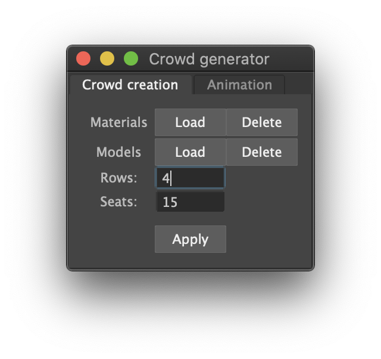
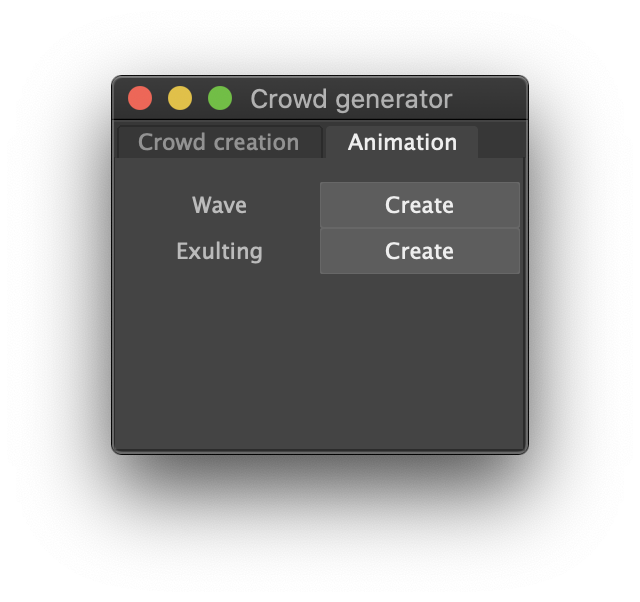

# Crowd generator

This script allow to create a crowd in Maya, consisting of:

* User interface to set values (import materials and models, set number of row/sits);
* Import several stickmans and places them in precise location;
* Personalize each stickman with random clothes, hairstyle and skin color;
* Add random animation to each character.

List of files:

* *createMaterials.py*: script that allow to create automatically several materials;
* *crowdGenerator.py*: main script, allow to create crowd;
* *faceSkinCreator.py*: allow to create several shaders composed of skin color material and face sketch texture;
* *layeredMaterial.py*:
* *materials.py*:

https://www.ni-mate.com/download/

TODO mettere foto risultato finale

  

# Script explanation (*crowdGenerator*)

Lo script permette di creare una folla e di aggiungere delle animazioni casuali ad ogni componente.

L'interfaccia grafica, la quale viene creata dalla funzione `createUI()`, è composta da due tab (Crowd creation e Animation). La prima permette di effettuare le seguenti operazioni:

* Caricare i materiali relativi al colore della pelle, capelli e abbigliamento;
* Caricare i modelli (stickman e capigliature);
* Impostare il numero di spettatori (numero di file e numero di posti per fila).

I pulsanti presenti nell'interfaccia grafica attivano i seguenti callback:

* `loadModelsCallback()`, permette di caricare i modelli;
* `deleteModelsCallback()`, permette di rimuovere i modelli già caricati;
* `loadMaterialsCallback()`, permette di caricare i materiali;
* `deleteMaterialsCallback`, permette di rimuovere i materiali già caricati;
* `applyCallback()`, permette di creare la folla in base ai valori impostati;
* `animWaveCallback()`, applica delle animazioni ad ogni elemento della folla; 
* `animExultanceCallback()`, applica delle animazioni casuali (tra quelle disponibili) ad ogni elemento della folla.

 

Di seguito le parti più importanti dei callback `loadMaterialsCallback()`, `deleteMaterialsCallback` e `loadModelsCallback()`

~~~~python
def loadMaterialsCallback( *pArgs ):
        cmds.file("./src/material/SGmHair00_08.mb", type='mayaBinary', 
            i= True, renameAll= True, mergeNamespacesOnClash=True, namespace=":", 
            loadReferenceDepth= "all", importFrameRate= True, importTimeRange="override")
        [...]
~~~~

~~~~python
def deleteMaterialsCallback( *pArgs ):
    bodyList = cmds.ls(el_to_delete)
        if len(bodyList)>0:
            cmds.delete(bodyList)
~~~~

~~~~python
def loadModelsCallback( *pArgs ):
    # Path variable
    folderPerson = r"./src"
    folderHair  = r"./src/hair"
    fileType = "mb"

    baseModel = cmds.getFileList(folder = folderPerson, filespec = "person_newModel.%s" % fileType)
    haircutModel = cmds.getFileList(folder = folderHair, filespec = "haircut*.%s" % fileType)
    
    # Delete existing models
    deleteModelsCallback()

    cmds.group( em=True, name='models' )

    importModels(haircutModel, folderHair,':')
    cmds.parent(cmds.ls("hair*"),'models')

    importModels(baseModel, folderPerson,'stickman')
    cmds.parent(cmds.ls("*:person*"),'models')

def importModels(model, folder, ns):    # ns: namespace
    transforms = []

    for item in model:
        fname = os.path.join(folder, item)
        objName, ext = os.path.splitext(os.path.basename(fname))
        # import each file
        imported_objects = cmds.file(fname, i=True, rnn=True, mergeNamespacesOnClash =False, namespace=ns, loadReferenceDepth='all', importFrameRate=True, type='mayaBinary') 
        transforms.append (cmds.ls(imported_objects, type='transform'))
~~~~

La funzione `loadModelsCallback()` determina tutti i file  *.mb* presenti nelle cartelle `./src` e `./src/hair`. Prima di importare i modelli, quelli presenti nel modello vengono rimossi attraverso il callback `deleteModelsCallback()`. La funzione `importModels()` carica, per ogni file presente nel path, il file corrispondente grazie alla funzione `cmds.file()`. Infine tutti i modelli caricati vengono raggruppati.