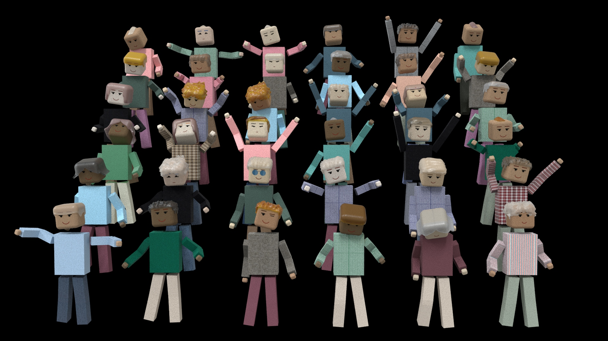

# Crowd generator

  

This plugin allow to create a crowd in Maya, consisting of:

* User interface to set values (import materials and models, set number of row/sits, randomize feature);
* Import several stickmans and places them in precise location;
* Personalize each stickman with random clothes, hairstyle and skin color;
* Add random animation to each character.
* Personalize selected character's feature (haircut, clothing and animations).

List of files:

* *createMaterials.py*: script that allow to skin material (`lambert`) and hair material (`lambert`);
* *crowdGenerator.py*: main script, allow to create crowd;
* *faceSkinCreator.py*: allow to create face textures (`place2dTexture`), layered texture for face material (`face textures` + `skin shader`) and then create an Arnold Standard surface (`aiStandardSurface`) composed of layer material color;
* *layeredMaterial.py*: allow to create layered material composed of skin material (`standardSurface`) and face texture (`place2dTexture`). Then create a Blinn material whose color is the outColor attribute of layered material;
* *materials.py*: allow to create skin surfaces (`standardSurface`), face textures (`place2dTexture`), layered texture composed of skin material and face texture and hair material (`lambert`). Then create a Lambert material whose color is the outColor attribute of layered material;

Read the wiki for more details.

 

# Results

  

Below the render of a frame of the scene.

 

